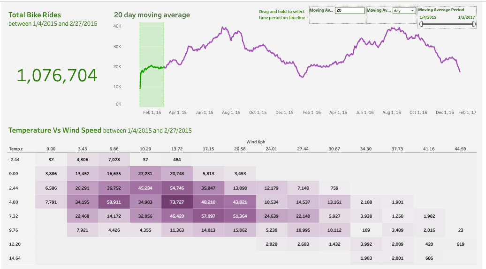

# London Bike Rides Analysis

## Project Overview

This project provides a comprehensive analysis of the London Bike Sharing dataset, exploring the relationship between bike usage and various environmental and seasonal factors. As urban areas continue to grow, sustainable transportation solutions like bike-sharing systems play a crucial role in reducing traffic congestion, conserving fuel, and lowering greenhouse gas (GHG) emissions.

The primary objective of this analysis is to demonstrate the operational dynamics of the bike-sharing system and to highlight the impact of weather conditions, seasons, and time of day on cycling frequency. By leveraging data analysis and business intelligence tools, this project transforms raw data into actionable insights effectively.

## Dashboard Screenshot

## Tableau Public Link

[View the interactive dashboard](https://public.tableau.com/shared/TZ4ZP26NJ?:display_count=n&:origin=viz_share_link)

## Data Source

The dataset used in this analysis is sourced from Kaggle: **London Bike Sharing Dataset**. It contains historical data on bike rides in London, along with meteorological information such as temperature, humidity, wind speed, and weather conditions.

## Technologies Used

*   **Python**: Used for data extraction, cleaning, and transformation.
    *   **Pandas**: For data manipulation and analysis.
    *   **Zipfile**: For handling compressed datasets.
    *   **Kaggle API**: For programmatic data retrieval.
*   **Tableau**: Used for creating interactive dashboards and visualizations.

## Analysis Workflow

The project follows a structured data analysis pipeline:

1.  **Data Extraction**: The dataset was programmatically downloaded using the Kaggle API and extracted for usage.
2.  **Data Assessment**: Initial exploration was conducted to understand the data structure, identifying 17,416 records with attributes like timestamp, count, temperature, and weather codes.
3.  **Data Cleaning & Transformation**:
    *   Renamed columns for better readability (e.g., changing 't1' to 'temp_real_C' and 'hum' to 'humidity_percent').
    *   Normalized humidity values to a percentage scale (0-1).
    *   Mapped categorical integers in 'season' and 'weather' columns to descriptive string labels (e.g., mapping '0' to 'Spring', '1' to 'Clear').
4.  **Data Export**: The cleaned and enriched dataset was exported to an Excel file (`london_bikes_final.xlsx`) to serve as the structured data source for visualization.
5.  **Visualization**: A Tableau dashboard was developed to visualize key metrics and trends.

## Insights and Environmental Impact

The analysis sheds light on usage patterns that are vital for urban planning and environmental sustainability:

*   **Greenhouse Gas Reduction**: Every bike ride represents a potential reduction in car usage, directly contributing to lower CO2 and other GHG emissions.
*   **Traffic Decongestion**: Higher bike usage during peak hours suggests a relief on the road network, reducing idle time and fuel consumption for other vehicles.
*   **Weather Sensitivity**: Understanding how ridership correlates with weather conditions (rain, temperature, wind) helps in demand forecasting and fleet management.

## How to Navigate This Repository

*   `LondonBikeRides.ipynb`: The Jupyter Notebook containing the Python code for data fetching, cleaning, and preprocessing.
*   `LondonBikeRides.twb`: The Tableau Workbook file containing the interactive dashboard and visualizations.
*   `london_merged.csv`: The raw dataset used for the analysis.
*   `london_bikes_final.xlsx`: The processed dataset (generated by the notebook) used for Tableau.

## Conclusion

This project showcases the intersection of data analytics and sustainability. By analyzing historical bike usage data, we can better understand the factors driving sustainable transport adoption and support initiatives that lead to cleaner, less congested cities.

## Author
Shubham Kulkarni
